# Лабораторная работа №8
## Тестирование, документирование и развёртывание FastAPI

**Студент:** Нургалеева К.А.
**Группа:** МОА-231

---
### Задание 0 Подготовительный этап: создание проекта и первого коммита:
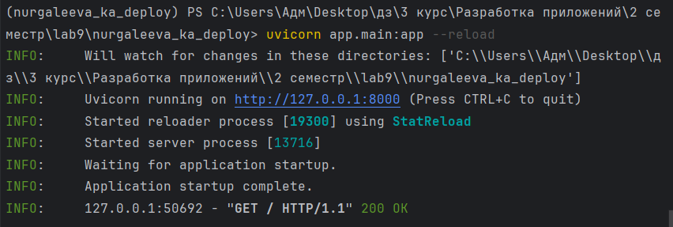

---

### Задание 1 Тестирование с pytest:
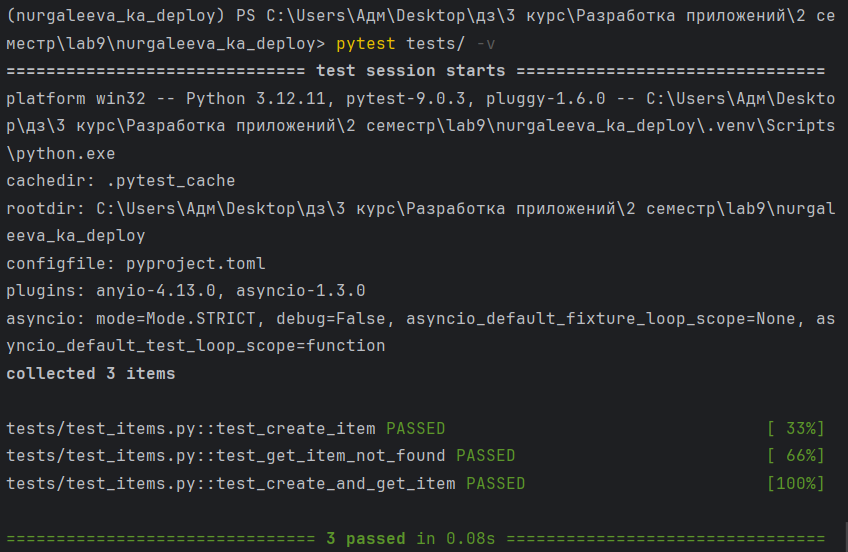

---

### Задание 2 Документирование API:
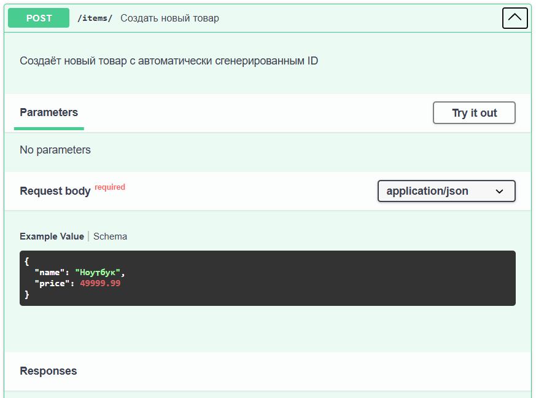
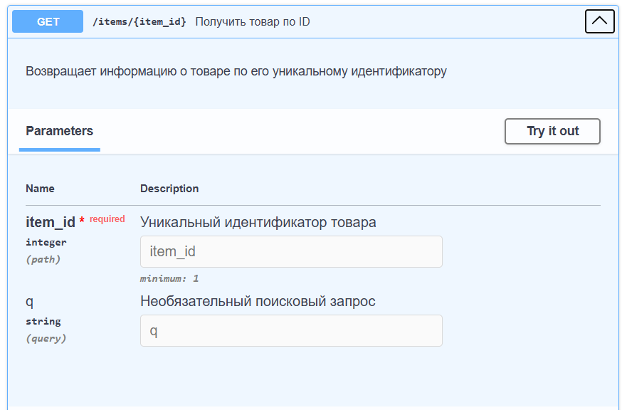

---

### Задание 3 Подготовка к деплою:
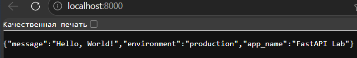
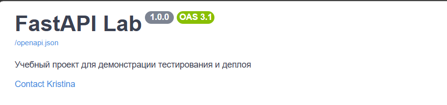

---

### Задание 4 Контейнеризация с Docker:
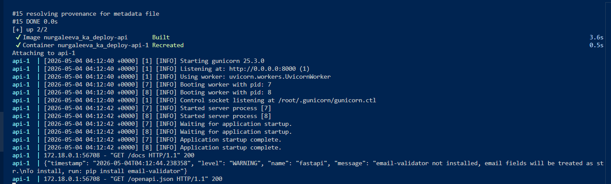
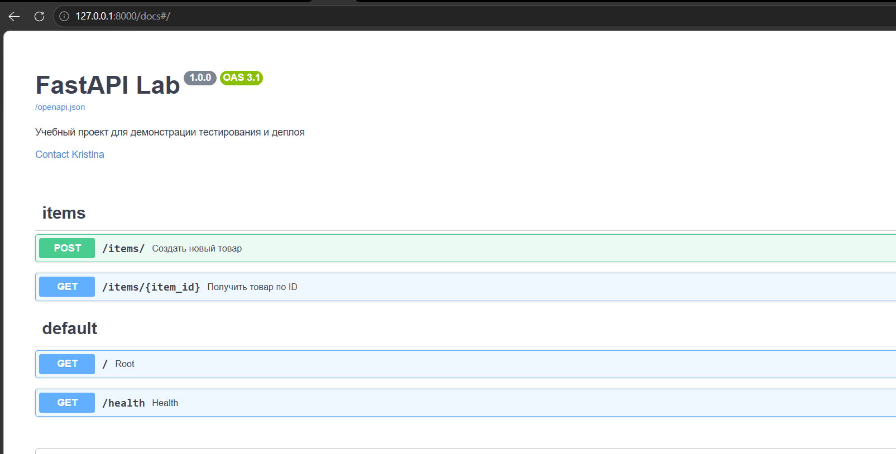

### Задание 5 Самостоятельная работа:
-5.1 Добавьте healthcheck эндпоинт
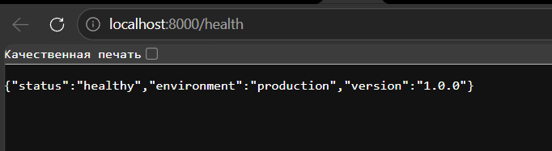
-5.2 Добавьте логирование в production
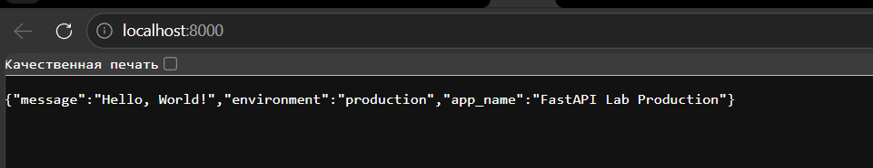
-5.3 Настройте Gunicorn с переменным числом воркеров
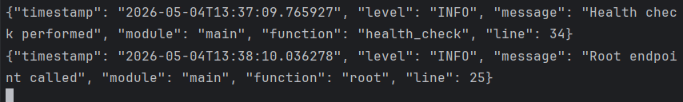

---

## Инструкция по установке и использованию

### Требования

- Python 3.8 или выше
- uv (менеджер пакетов)
- Git

### Клонирование репозитория

```bash
git clone https://github.com/nurgaleeva4/nurgaleeva_ka_deploy.git
cd nurgaleeva_ka_deploy
